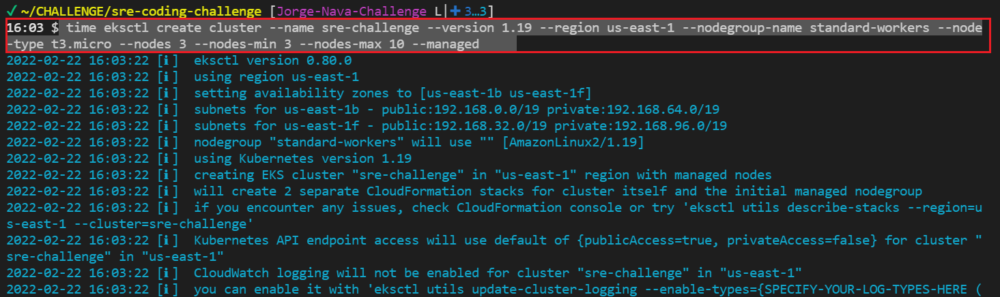
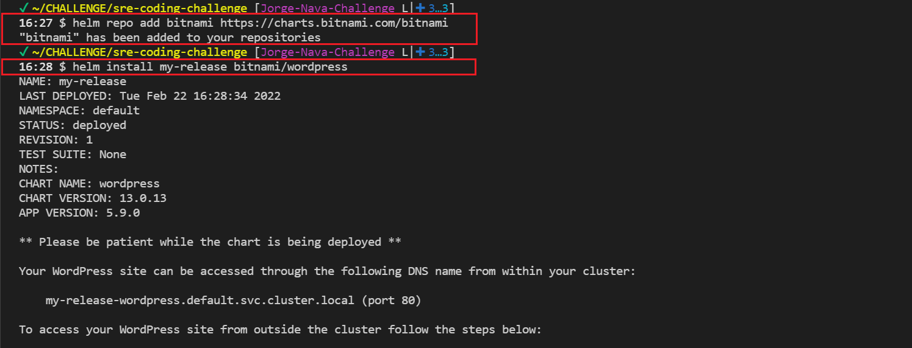
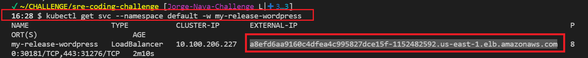
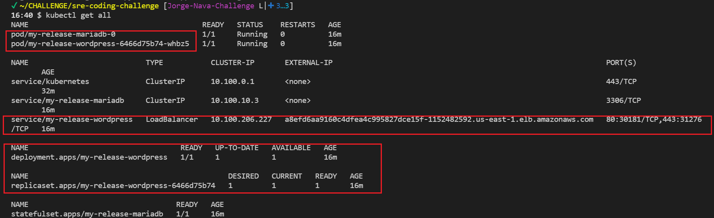
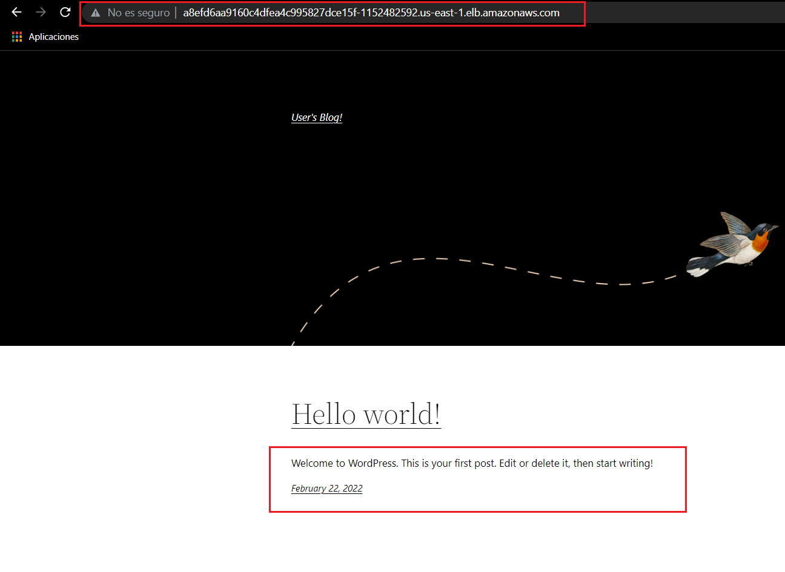
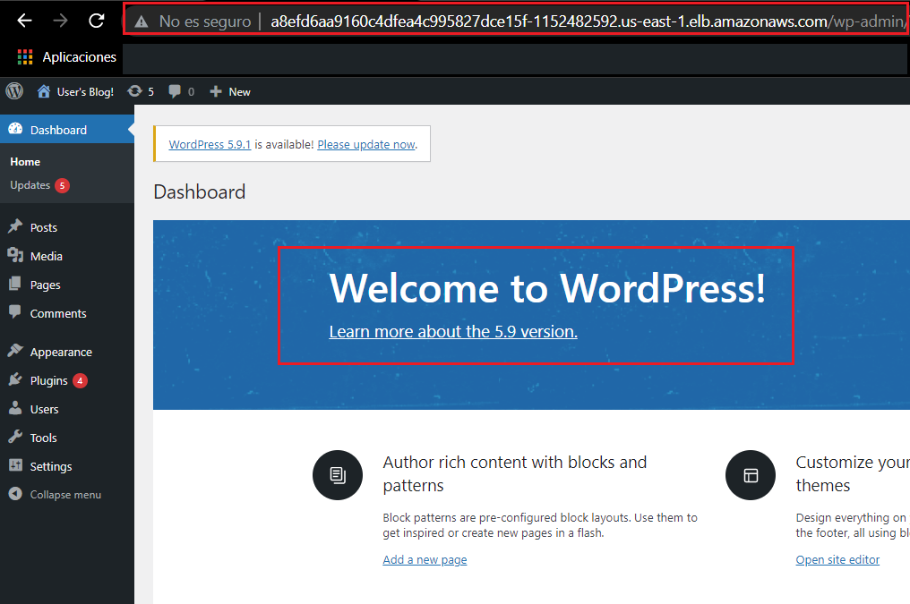

# sre-coding-challenge
Public Repo for Altais Coding Challenge

# Answers to Challenge Questions
* 1 Create s3 
* * manual with awscli (you need to create bucket previously)  \
    aws s3 cp ../file.txt  s3://$bucket-challenge-s-jorge-nava-challenge
* * via terraform (file in charge of upload s3 object after terraform apply) \
 aws s3 cp ../file.txt  s3://$bucket-challenge-s-jorge-nava-challenge 
 
* 2 - On upload trigger - Code can be found in file ->  s3_alert_via_sns.tf. Flow for s3 bucket notification 
* * After Terraform code execution an email will be sent ans user needs to accept email Subscription 
* *  After the file upload use will receive via email an alert  

* 3 unit test via terratest
```
Go install for Linux - https://golang.org/doc/install

wget https://go.dev/dl/go1.17.7.linux-amd64.tar.gz
sudo rm -rf /usr/local/go && sudo tar -C /usr/local -xzf go1.17.7.linux-amd64.tar.gz
export PATH=$PATH:/usr/local/go/bin
#GOPATH=/home/ec2-user/go
go version
```

## Usage
```
got clone https://github.com/xerris/terratest-AWS
cd terratest-AWS
Initialize module test
go mod init test

#to test 
cd test
go test -v
 ```
* 4 
* 5 Architecture of project

* 6  
```
        curl -L https://git.io/get_helm.sh | bash -s -- --version v3.0.0
        helm repo add bitnami https://charts.bitnami.com/bitnami
        helm install my-release bitnami/wordpress 
```

 * Cluster creation via eksctl.



 * Helm chart configuration  and Install.



 * Kubernetes service.



 * Kubernetes objects.



 * Access to Wordpress via Load balancer.


 * Access to Wordpress admin console
 * user -> user
 * get password from secret   -> kubectl get secrets/my-release-wordpress -o jsonpath="{.data.wordpress-password}" | base64 --decode;echo


# Code Documentation Below

## How to run code for Questions (1,2,4,5)
```
#set aws keys
export AWS_ACCESS_KEY_ID=xxxxxxxxxxxx
export AWS_SECRET_ACCESS_KEY=xxxxxxxxxxxx

cd terraform-code
terraform fmt -recursive
terraform init
terraform plan
terraform apply --auto-approve
```
## How to run code for Question  (3)
```
terraform fmt -recursive
terraform init
terraform plan
terraform apply --auto-approve
```

## Providers

| Name | Version |
|------|---------|
| <a name="provider_aws"></a> [aws](#provider\_aws) | 4.2.0 |


## Resources

| Name | Type |
|------|------|
| [aws_instance.instance](https://registry.terraform.io/providers/hashicorp/aws/latest/docs/resources/instance) | resource |
| [aws_internet_gateway.igw](https://registry.terraform.io/providers/hashicorp/aws/latest/docs/resources/internet_gateway) | resource |
| [aws_route_table.public-route](https://registry.terraform.io/providers/hashicorp/aws/latest/docs/resources/route_table) | resource |
| [aws_route_table_association.public-rt-association](https://registry.terraform.io/providers/hashicorp/aws/latest/docs/resources/route_table_association) | resource |
| [aws_s3_bucket.bucket](https://registry.terraform.io/providers/hashicorp/aws/latest/docs/resources/s3_bucket) | resource |
| [aws_s3_bucket_notification.bucket_notification](https://registry.terraform.io/providers/hashicorp/aws/latest/docs/resources/s3_bucket_notification) | resource |
| [aws_security_group.sg](https://registry.terraform.io/providers/hashicorp/aws/latest/docs/resources/security_group) | resource |
| [aws_sns_topic.sns_alert_topic](https://registry.terraform.io/providers/hashicorp/aws/latest/docs/resources/sns_topic) | resource |
| [aws_sns_topic_subscription.email-target](https://registry.terraform.io/providers/hashicorp/aws/latest/docs/resources/sns_topic_subscription) | resource |
| [aws_subnet.public-subnet](https://registry.terraform.io/providers/hashicorp/aws/latest/docs/resources/subnet) | resource |
| [aws_vpc.vpc](https://registry.terraform.io/providers/hashicorp/aws/latest/docs/resources/vpc) | resource |

## Inputs

| Name | Description | Type | Default | Required |
|------|-------------|------|---------|:--------:|
| <a name="input_region"></a> [region](#input\_region) | n/a | `string` | `"us-east-1"` | no |
| <a name="input_usage"></a> [usage](#input\_usage) | n/a | `string` | `"jorge-nava-challenge"` | no |

## Outputs

| Name | Description |
|------|-------------|
| <a name="output_public_ip"></a> [public\_ip](#output\_public\_ip) | n/a |
