# sre-coding-challenge
Public Repo for Altais Coding Challenge

# Answers to Challenge Questions
## 1 - Create s3 
* * manual with awscli (you need to create bucket previously, replace file.txt by any other file you want)  \
    aws s3 cp ../file.txt  s3://$bucket-challenge-s-jorge-nava-challenge
* * via terraform (file in charge of upload s3 object after terraform apply) \
 terraform-code/s3_file.tf
 
## 2 - On upload trigger - Code can be found in file ->  s3_alert_via_sns.tf. Flow for s3 bucket notification 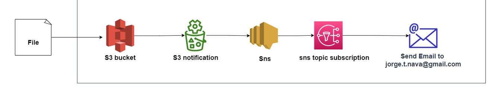
* * After Terraform code execution an email will be sent ans user needs to accept email Subscription 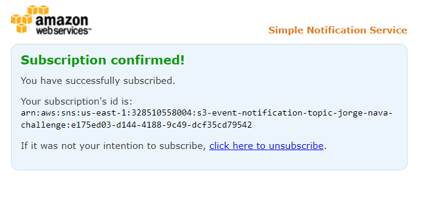
* *  After the file upload use will receive via email an alert  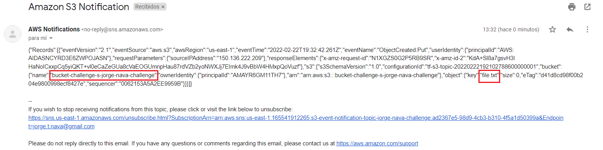

## 3 unit test via terratest
```
Go install for Linux - https://golang.org/doc/install

wget https://go.dev/dl/go1.17.7.linux-amd64.tar.gz
sudo rm -rf /usr/local/go && sudo tar -C /usr/local -xzf go1.17.7.linux-amd64.tar.gz
export PATH=$PATH:/usr/local/go/bin
go version
```

## Terratest 
Usage
```
export PATH=$PATH:/usr/local/go/bin
go version

# clone $repo
cd terratest 
# Initialize module test
go mod init test
```
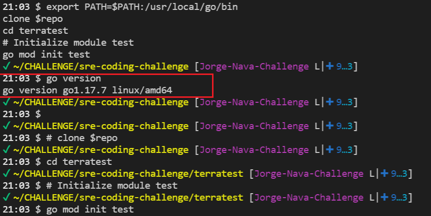

```
#to test 
go test -v
 ```
 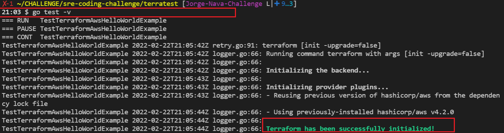
 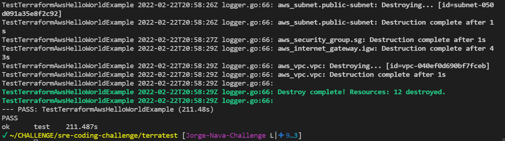
 
## 4 Create trough terraform
* * vpc, igw,route table, subnet,security group \

    terraform file incharged  - terraform-code/networking_config.tf

* * ec2 runnign webserver \

    terraform file incharged  - terraform-code/ec2_webserver.tf 
    
# How to run code for Questions (1,2,4,5)
```
#set aws keys
export AWS_ACCESS_KEY_ID=xxxxxxxxxxxx
export AWS_SECRET_ACCESS_KEY=xxxxxxxxxxxx

cd terraform-code
terraform fmt -recursive
terraform init
terraform plan
terraform apply --auto-approve

# output after apply
Plan: 12 to add, 0 to change, 0 to destroy.

Changes to Outputs:
  + public_ip = (known after apply)
aws_vpc.vpc: Creating...
aws_s3_bucket.bucket: Creating...
aws_vpc.vpc: Still creating... [10s elapsed]
aws_s3_bucket.bucket: Still creating... [10s elapsed]
aws_vpc.vpc: Creation complete after 12s [id=vpc-0009e4c428d558ac8]
aws_subnet.public-subnet: Creating...
aws_internet_gateway.igw: Creating...
aws_security_group.sg: Creating...
aws_internet_gateway.igw: Creation complete after 0s [id=igw-0b41bd1659b82f5a2]
aws_route_table.public-route: Creating...
aws_route_table.public-route: Creation complete after 2s [id=rtb-0cd01e73bdd6c6616]
aws_security_group.sg: Creation complete after 3s [id=sg-0bcde68b75988e487]
aws_s3_bucket.bucket: Still creating... [20s elapsed]
.
.
.
```
## 5 Architecture of project
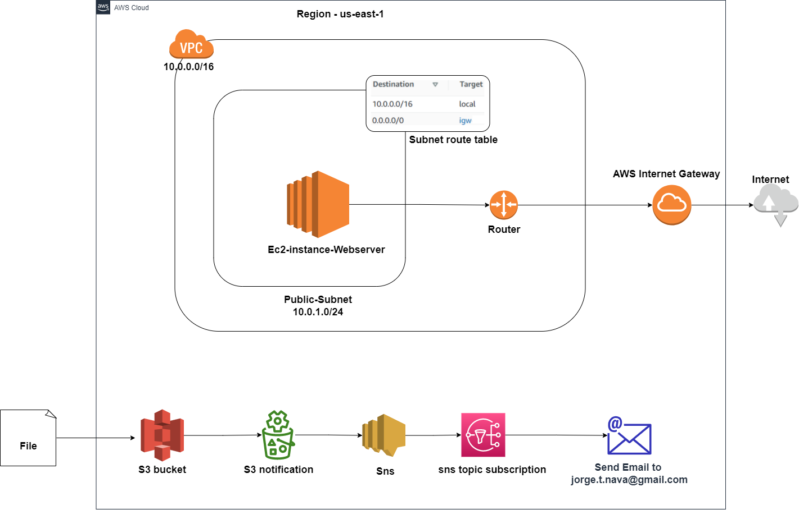
## 6  Kubernetes (via helm / via manifest) from scratch

 This Helm chart will create all resources needed for a worpress (secrets,deployments,services...)\
Cluster creation 
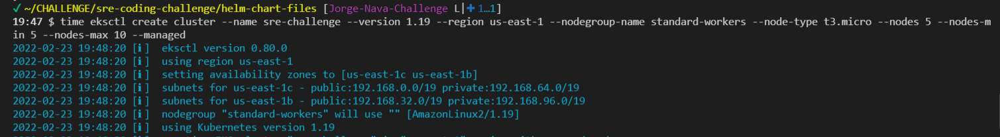 
Enter to helmchart folder \

cd helm-chart-files \
helm install jorge-nava-helmchart jorge-nava-wordpress-helmchart 

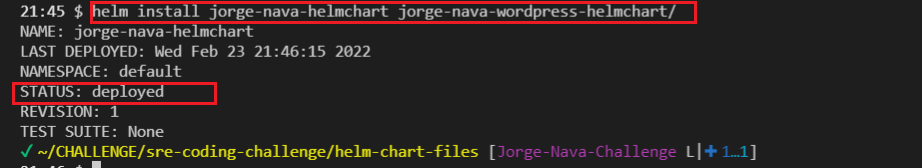
List resources created by helm-chart \
kubectl get all
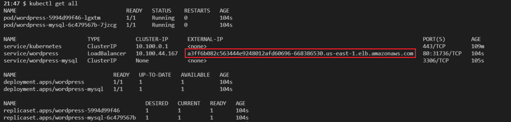
Get url from loadbalancer via jsonpath \
url="http://$(kubectl get service/wordpress -o=jsonpath='{.status.loadBalancer.ingress[0].hostname}')/wp-admin/install.php" \
echo $url 
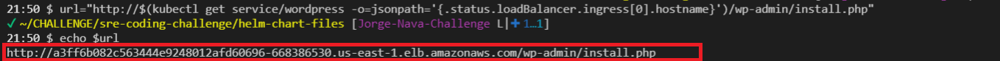
Test wordpress install via loadbalancer
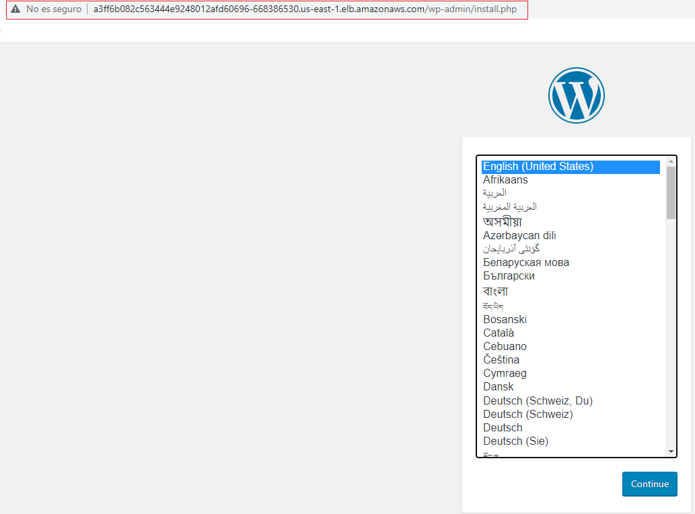

# Code Documentation Below


## Providers

| Name | Version |
|------|---------|
| <a name="provider_aws"></a> [aws](#provider\_aws) | 4.2.0 |

## Resources

| Name | Type |
|------|------|
| [aws_instance.instance](https://registry.terraform.io/providers/hashicorp/aws/latest/docs/resources/instance) | resource |
| [aws_internet_gateway.igw](https://registry.terraform.io/providers/hashicorp/aws/latest/docs/resources/internet_gateway) | resource |
| [aws_route_table.public-route](https://registry.terraform.io/providers/hashicorp/aws/latest/docs/resources/route_table) | resource |
| [aws_route_table_association.public-rt-association](https://registry.terraform.io/providers/hashicorp/aws/latest/docs/resources/route_table_association) | resource |
| [aws_s3_bucket.bucket](https://registry.terraform.io/providers/hashicorp/aws/latest/docs/resources/s3_bucket) | resource |
| [aws_s3_bucket_notification.bucket_notification](https://registry.terraform.io/providers/hashicorp/aws/latest/docs/resources/s3_bucket_notification) | resource |
| [aws_s3_object.object](https://registry.terraform.io/providers/hashicorp/aws/latest/docs/resources/s3_object) | resource |
| [aws_security_group.sg](https://registry.terraform.io/providers/hashicorp/aws/latest/docs/resources/security_group) | resource |
| [aws_sns_topic.sns_alert_topic](https://registry.terraform.io/providers/hashicorp/aws/latest/docs/resources/sns_topic) | resource |
| [aws_sns_topic_subscription.email-target](https://registry.terraform.io/providers/hashicorp/aws/latest/docs/resources/sns_topic_subscription) | resource |
| [aws_subnet.public-subnet](https://registry.terraform.io/providers/hashicorp/aws/latest/docs/resources/subnet) | resource |
| [aws_vpc.vpc](https://registry.terraform.io/providers/hashicorp/aws/latest/docs/resources/vpc) | resource |

## Inputs

| Name | Description | Type | Default | Required |
|------|-------------|------|---------|:--------:|
| <a name="input_region"></a> [region](#input\_region) | n/a | `string` | `"us-east-1"` | no |
| <a name="input_usage"></a> [usage](#input\_usage) | n/a | `string` | `"jorge-nava-challenge"` | no |

## Outputs

| Name | Description |
|------|-------------|
| <a name="output_public_ip"></a> [public\_ip](#output\_public\_ip) | n/a |
